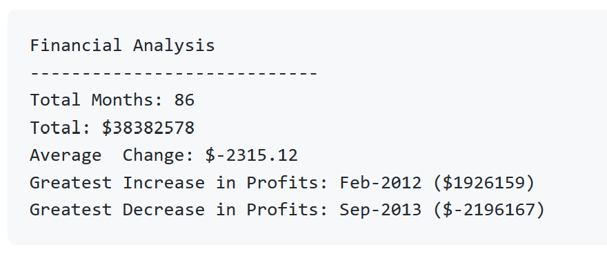

# pthon-homeworky
## Unit 2 | Homework Assignment: Automate Your Day Job with Python
## [Completed Assignment](PyBank/resources/main.ipynb)

```
_________________________________________________________________
  _______            ______         __       __    __  __     _
  |   __ "\         |   _  "\      /""\     |  \  |  ||  |   / )
  (. |__) :) _   _  |(.|  ) )     / /\ \    |  |\ |  ||  |  / / 
  |: _____/  \\ )"| |: |_ \/     / '  \ \   |  | \|  ||  |_/ /              
  (|  /       ):"/  |( | _ \    /  ___"  \  |  |  \  ||   _<(: 
  /|_/|     __/ /   ||:|__) :) /  /    \  \ |  |  :\ ||  | \  \  
 (_____)   (___/    |(______/ (__/      \__)|__ ) (_`)|__)  \__)
_________________________________________________________________
By: Nelson Lubinda
```
## ACTIVITY
In this activity, I am tasked with creating a Python script for analyzing the financial records of my company. A financial dataset in the [budget_data.csv](PyBank/resources/budget_data.csv) file is provided. This dataset is composed of two columns, Date and Profit/Losses. 
## REQUIREMENTS:
Task at hand is to create a Python script that analyzes the records to calculate each of the following:
   - The total number of months included in the dataset.
   - The net total amount of Profit/Losses over the entire period.
   - The average of the changes in Profit/Losses over the entire period.
   - The greatest increase in profits (date and amount) over the entire period.
  -  The greatest decrease in losses (date and amount) over the entire period.
## End Result
Produce results formatted in this manner

## COMPLETED ASSIGNMENT
Click [completed_assignment](PyBank/resources/main.ipynb) to veiw my completed assignment.
